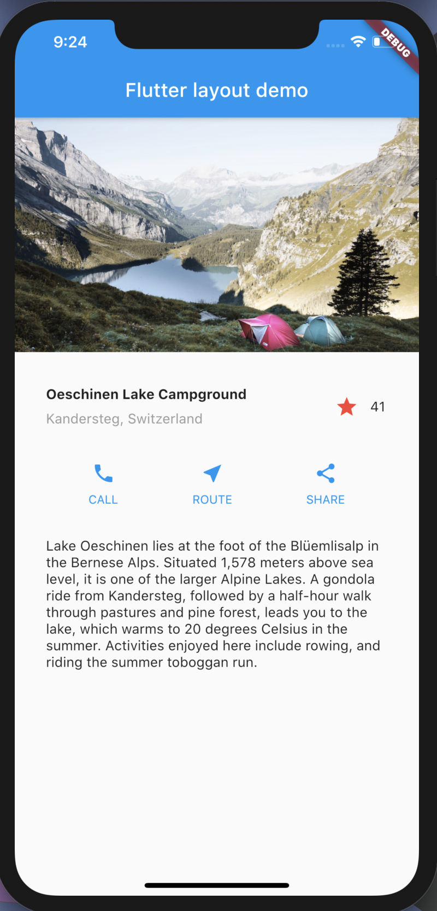

# Flutter Interactive Layout Demo

A new Flutter project.

## Intro

[This project is inspired by Flutter docs on Flutter Interactive Layout](https://flutter.dev/docs/development/ui/layout/tutorial)

## What does it do ?
- Basic Layout of an app
- Handling States of widgets 

## Screenshots

